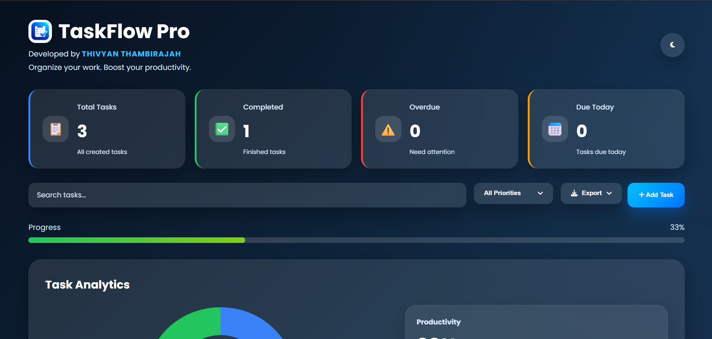

# 🚀 TaskFlow Pro

> A modern and responsive Kanban Task Management Dashboard built with **HTML, CSS, and JavaScript**.

<p align="center">

<a href="https://thivyanthambirajah.github.io/TaskFlow/" target="_blank">

</a>

<a href="https://github.com/ThivyanThambirajah/TaskFlow" target="_blank">

</a>

</p>

<p align="center">


</p>

<p align="center">

⭐ Modern UI & UX &nbsp;&nbsp;&nbsp; | &nbsp;&nbsp;&nbsp;
📱 Responsive Design &nbsp;&nbsp;&nbsp; | &nbsp;&nbsp;&nbsp;
💾 Local Storage &nbsp;&nbsp;&nbsp; | &nbsp;&nbsp;&nbsp;
📊 Analytics Dashboard &nbsp;&nbsp;&nbsp; | &nbsp;&nbsp;&nbsp;
🌙 Dark / Light Mode

</p>

---

## 📸 Preview

<p align="center">



</p>

---

## ✨ Features

- 📋 Kanban Board (To Do, In Progress, Done)
- 📊 Interactive Analytics Dashboard
- 🌙 Dark & Light Mode
- 🔍 Real-time Task Search
- 🎯 Priority Filtering
- 📅 Due Date Tracking
- 📈 Progress Bar
- 📤 Export Tasks (CSV & JSON)
- 🖱️ Drag & Drop Tasks
- 💾 Local Storage Support
- 📱 Responsive Design

---

## 🛠 Technologies Used

- HTML5
- CSS3
- JavaScript (ES6)
- Chart.js
- Font Awesome

---

## 📂 Project Structure

```text
TaskFlow/
│
├── images/
│
├── js/
│   ├── chart.js
│   ├── dragdrop.js
│   ├── script.js
│   ├── search.js
│   ├── storage.js
│   ├── theme.js
│   ├── toast.js
│   └── ui.js
│
├── index.html
├── style.css
└── README.md
```

---

## 🚀 Future Improvements

- User authentication
- Cloud synchronization
- Mobile application
- Calendar integration
- Task reminders
- Team collaboration

---

## 👨‍💻 Developed By

**Thivyan Thambirajah**

---

## ⭐ Support

If you like this project, consider giving it a ⭐ on GitHub.